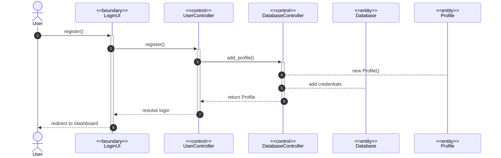
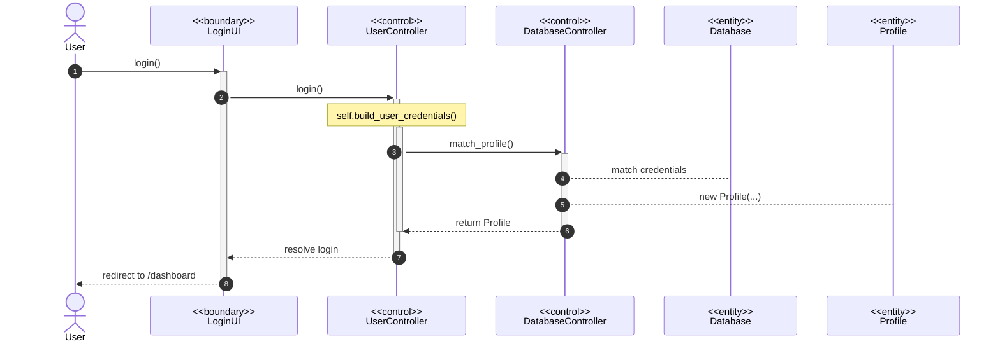
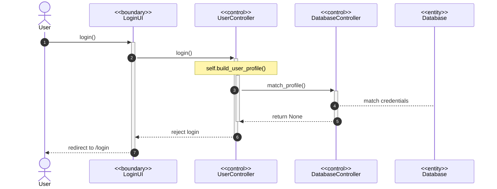
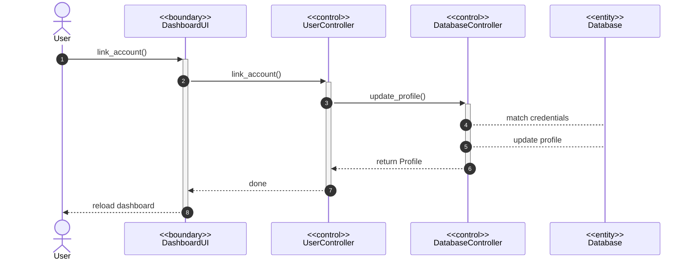
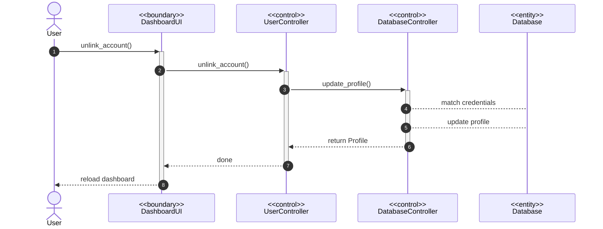
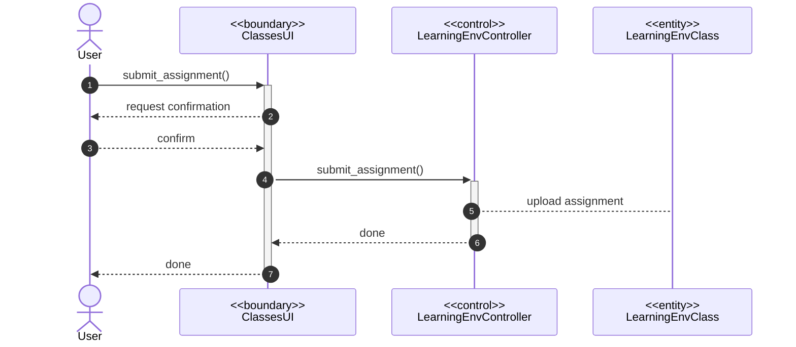
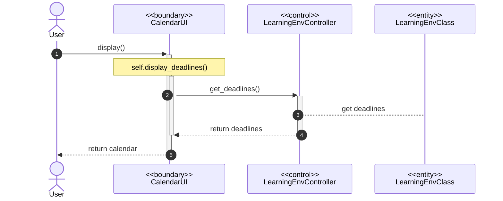
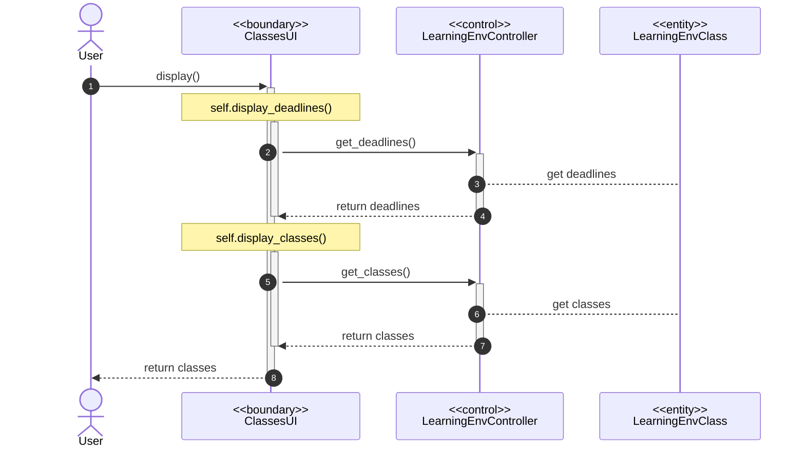

# Access Dashboard
### Scenario 1 - User creates an account on the application

### Scenario 2 - User logs in to the application (correct credentials)

### Scenario 3 - User logs in to the application (incorrect credentials)

### Scenario 4 - User links external services provider to the application

### Scenario 5 - User unlinks external service provider

### Scenario 6 - User submits requirements via the application

# View Requirements
### Scenario 1 - User accessed dashboard view

### Scenario 2 - User accessed calendar view

### Scenario 3 - User accessed class card view
